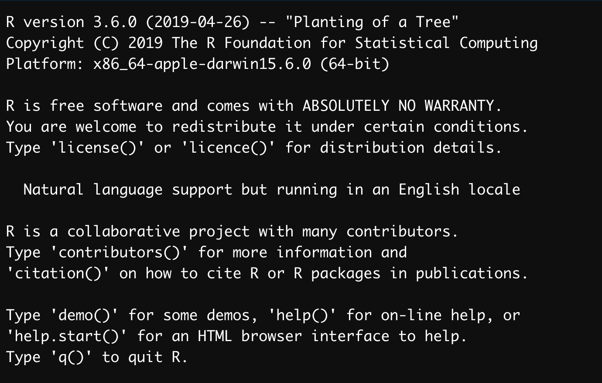
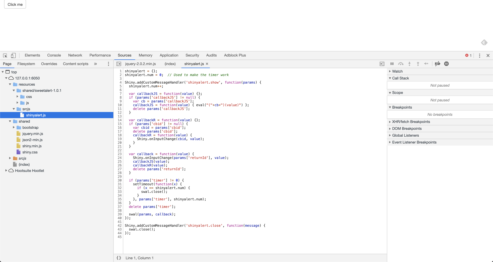

# What is a license (and why you should care) {#whatis}

`r disclaimer()`

`r button_code()`

## Copyright is everywhere

Licensing is an hard but essential part of any software project: it defines what others can and cannot do with a piece of code you've written. 
It's crucial to have a sense of what the license you're choosing implies: it can impact the reuse of your code, or prevent others from using it. 
For example, choosing a very permissive license implies that your code can be reused in a military or commercial context, while a too restrictive license can prevent anybody from reusing your code.  

As stated in the R Manuals:

> "It is very important that you include license information! Otherwise, it may not even be legally correct for others to distribute copies of the package, let alone use it." 

<div class = "right">
[Writting R Extension](https://cran.r-project.org/doc/manuals/r-release/R-exts.html#Licensing)
</div>

### Everything is copyrighted

> [C]opyright is automatically attached to every novel expression of an idea, whether through text, sounds, or imagery. (...) the words in this paragraph are protected by copyright as soon as they are written.

<div class = "right">
[Understanding Open Source and Free Software Licensing - Andrew M. St. Laurent](https://www.oreilly.com/library/view/understanding-open-source/0596005814/)
</div>

Any newly created piece of code is protected by copyright as soon as it's written down. 
In other words, as soon as you have created a piece of code, the copyright of these lines belongs to you, and if you don't attach any license to it it's copyrighted under your name. 
That also means that if you don't attach a license to your code, it can be hard (or even impossible) to (re)use it.
For example, it's in practice complicated if not impossible to reuse a piece of code found on GitHub if there is no explicit license.

How is this an issue? 
Let's start with an example outside of the R world, with the `bootstrap` library. 
In [this issue](https://github.com/twbs/bootstrap/issues/2054) from 2012, a user asked for a License change: [cweagans](https://github.com/cweagans) wants to include the bootstrap library inside a Drupal distribution, but Bootstrap's license at that time being `APLv2`, it was incompatible with `GPLv2`. 
After almost two years (and 213 comments on the issue), `Bootstrap` [switched to the MIT license](https://github.com/twbs/bootstrap/issues/2054#issuecomment-30894685).
And, as the comment on the issue relates, _"The remaining Apache-only commits were reverted by #11927 and replaced by rewritten, MIT-licensed commits in #11928"_, meaning that some code had to be rewritten to make the code-base compliant with the new MIT license. 

But this was not an easy task: if you decide to change from one license to another, you need to get the permission from __all__ the contributors. 
This was the case in Bootstrap ([_"The fun part of this effort will be getting every contributors explicit permission to make the change"_](https://github.com/twbs/bootstrap/issues/2054#issuecomment-9090952)): more than 530 people had contributed to the project (more than 1000 today) at the time of the license change... $
In the R-world, we can find an example with the R package `{covr}`, which had the same discussion when Jim Hester wanted to switch [from MIT to GPL-3](https://github.com/r-lib/covr/issues/256). 

Changing license is not only a technical matter: some developers have strong feelings about licenses and open source philosophy, so it can be hard (if not impossible) to make them accept a license change. 
So in fact, it might be more a matter of politics before code when it comes to license change. 
Meaning that it's important to consider from the very beginning of your project what the license will be: it's easier to spend some time now thinking about this than spend hours debating on Github about license change. 

### Use, and reuse

> Licensors should read and understand the terms and conditions of the license they choose before applying it. 

<div class = "right">
[CC-BY-SA-4.0](https://www.r-project.org/Licenses/CC-BY-SA-4.0)
</div>

One solution to prevent any kind of "problem" is to go for a very permissive license like the MIT license, which more or less states that one can do anything with the piece of code, as long as they keep the original notice and do not keep the developer liable for the code. 

```{r result = "asis", echo = FALSE}
glue::as_glue(readLines("https://www.r-project.org/Licenses/MIT"))
```

On the other hand, going for a license which is too permissive can allow anybody to reuse your code: for commercial, and even for military purposes. 
This is for example the reason why some contributors to Bootstrap didn't want to change to the MIT: they had concern about patent and / or commercial reuse of the software. 

### Secure yourself

Defining a license is also a way for you to secure the potential reuse (and misuse) of your code.
In almost every open source license, you'll find a disclaimer of non liability: most of these licenses also oblige the re-user of the code to explicitly re-share this disclaimer.
In the MIT license we've just printed, you can see this extract: 

```
THE SOFTWARE IS PROVIDED "AS IS", WITHOUT WARRANTY OF ANY KIND, EXPRESS OR IMPLIED, INCLUDING BUT NOT LIMITED TO THE WARRANTIES OF
MERCHANTABILITY, FITNESS FOR A PARTICULAR PURPOSE AND NONINFRINGEMENT. IN NO EVENT SHALL THE AUTHORS OR COPYRIGHT HOLDERS BE LIABLE FOR ANY CLAIM, DAMAGES OR OTHER LIABILITY, WHETHER IN AN ACTION OF CONTRACT, TORT OR OTHERWISE, ARISING FROM, OUT OF OR IN CONNECTION WITH THE SOFTWARE OR THE USE OR OTHER DEALINGS IN THE SOFTWARE.
```

This specific piece of the license, which exists (with some variation) in almost every open source license, is the part that protects you in case of a potential misuse of your code. 
With it, you're clearly stating that you're providing the piece of code without any kind of guaranty, "as is", and you can't be hold liable for what people will do with your code. 
That means that if ever someone uses your code and experience data loss or system breaks, you won't be made responsible.

That's what you'll see printed when you open R: 



Side note: this guaranty of non liability is one of the reason why some companies refuse to switch to R, because "at least a proprietary software comes with a series of guarantees". 
But in reality most proprietary softwares do not come with an extensive guarantee.
For example, here's the extract from the SAS license relative to liability: 

```
SAS DOES NOT WARRANT OR REPRESENT THAT CUSTOMER’S USE OF THE PRODUCT, SYSTEM OR WORK PRODUCT, AS APPLICABLE, WILL RESULT IN CUSTOMER’S COMPLIANCE, FULFILLMENT OR CONFORMITY WITH THE LAWS, RULES, REGULATIONS, REQUIREMENTS OR GUIDELINES OF ANY GOVERNMENTAL AGENCY
```

See also : 

+ [Absolutely no warranty?](https://notstatschat.rbind.io/2019/02/18/absolutely-no-warranty/)
+ [R est un logiciel libre et n’est livré avec ABSOLUMENT AUCUNE GARANTIE.](https://thinkr.fr/r-est-un-logiciel-libre-et-nest-livre-avec-absolument-aucune-garantie/) (in French).

## Key terms of licensing 

license is a document that defines how a piece of software, as a whole (i.e. in source form or packaged), can be __used, reused__, __modified__, __distributed__, and __linked to__. 
Deciphering license texts can be a hard task as they come with a series of technical terms. 
Let's start by gathering some definitions about these terms. 

__Disclaimer__: there are disagreements about some definition of these terms. 
The definition below are gathered from various sources, and should be taken as guideline, not as legal advice.  

### Standard & Modified versions 

Dealing with someone else code in your project implies that this piece of code can live through two versions: the standard one, and the modified version. What do these versions cover?

As defined in [AGPL-3](https://www.r-project.org/Licenses/AGPL-3), 

> To "modify" a work means to copy from or adapt all or part of the work in a fashion requiring copyright permission, other than the making of an exact copy. The resulting work is called a "modified version" of the earlier work or a work "based on" the earlier work.

And as defined in [Artistic-2.0](https://www.r-project.org/Licenses/Artistic-2.0), 

> "Standard Version" refers to the Package if it has not been modified, or has been modified only in ways explicitly requested by the Copyright Holder.

> "Modified Version" means the Package, if it has been changed, and such changes were not explicitly requested by the Copyright Holder.

Note that under this license, a bug fix or portability changes is not considered as a modification: 

> You may apply any bug fixes, portability changes, and other modifications made available from the Copyright Holder.  The resulting Package will still be considered the Standard Version, and as such will be subject to the Original License.

As defined in [CC-BY-SA-4.0](https://www.r-project.org/Licenses/CC-BY-SA-4.0), 

> Adapted Material means material subject to Copyright and Similar Rights that is derived from or based upon the Licensed Material and in which the Licensed Material is translated, altered, arranged, transformed, or otherwise modified in a manner requiring permission under the Copyright and Similar Rights held by the Licensor

To sum up: the standard version is the one that exists as is, as it is distributed by the author of the code. 
The adapted version is a derivation of the original code. 
For example, with R, the standard version of a package is the one that you'll get when installing a package from CRAN: you receive the package as it was distributed by the package author. 
A modified version would be, for example, cloning a package repo and modifying some functions. 
Same goes for R: you can use the standard version of R, or create your own version of the software.

Note that with most licenses, modified versions are covered by specific permissions / obligations.  

For example, [AGPL-3](https://www.r-project.org/Licenses/AGPL-3) states that: 

> Notwithstanding any other provision of this License, if you modify the Program, your modified version must prominently offer all users interacting with it remotely through a computer network (if your version supports such interaction) an opportunity to receive the Corresponding Source of your version by providing access to the Corresponding Source from a network server at no charge, through some standard or customary means of facilitating copying of software.

### Use, distribute

A license defines the way one can use, reuse and distribute a piece of software. 

Using refers to installing and run a piece of software. 
For example, installing and launching R is running it. 
Calling `install.packages("package"); library(package)` is running this package. 
Distributing, on the other hand, is sharing the code. 
For example, sending an R package to be published on CRAN is distribution. 
So is publishing on GitHub.

The distinction between these two is important, as most licenses make a clear distinction about how you can use and distribute the code. 
In most licenses, you are free to use the software for private use, and allow to redistribute the standard version without restriction, providing you share with it the warranty of non liability and explicitly state which piece of code is covered by the license.  
Some licenses prevent from redistributing the modified version, unless you share the modified version under the same license.

For example, as defined in [Artistic-2.0](https://www.r-project.org/Licenses/Artistic-2.0), 

> You are permitted to use the Standard Version and create and use Modified Versions for any purpose without restriction, provided that you do not Distribute the Modified Version.

> You may Distribute verbatim copies of the Source form of the Standard Version of this Package in any medium without restriction, either gratis or for a Distributor Fee, provided that you duplicate all of the original copyright notices and associated disclaimers.  

Distribution of modified versions of a software under the Artistic License is possible under some conditions, i.e. making the modified version available to the author, and stating in the modified version which pieces have been modified and how it differs from the standard version.

Distributing, also called "convey", is defined in [Artistic-2.0](https://www.r-project.org/Licenses/Artistic-2.0) as: 

> providing a copy of the Package or making it accessible to anyone else, or in the case of a company or organization, to others outside of your company or organization.

The interesting thing here is that sharing a copy of the code / modified version of the code does not constitute a distribution if it stays inside your company. 

Note also that GPL also allows private modification of a program: you need to comply to GPL compatibility if you distribute the modified version:

>  To "propagate" a work means to do anything with it that, without permission, would make you directly or secondarily liable for infringement under applicable copyright law, __except executing it on a computer or modifying a private copy__.

So what about Shiny apps? As defined in [AGPL-3](https://www.r-project.org/Licenses/AGPL-3), 

> to "convey" a work means any kind of propagation that enables other parties to make or receive copies. Mere interaction with a user through a computer network, with no transfer of a copy, is not conveying.

A reading of this paragraph can lead to the conclusion that no code is transferred when you're accessing a Shiny App as a user. 
This might enter in the case stating in AGPL that _"This License explicitly affirms your unlimited permission to run the unmodified Program"_.
But it's important to note that there are two ways a Shiny app uses and shares code: there is the code written on the server side (the R one mainly), which is not available for the end user in the browser, and the code in JavaScript and CSS that is sent to the browser with your app. 
For example, if you call `use_shinyalert()` from the `{shinyalert}` package in your Shiny app, you're actually __distributing__ a part of the JavaScript code from `{shinyalert}`, as it is available to be copied from the browser. 
As you can see, if I go to the "Source" tab of the `{shinyalert}` example app, I have access to the internal JavaScript files from the package (and I can make copies of this code if I want).



So, if the AGPL code is on the server side, you might not be conveying the R code. 
On the other end, remember that using JavaScript / CSS code in Shiny is conveying/distributing that code as you are making it available to any user of the app through their browser.

Whether or not conveying AGPL licenses, unmodified code influences the rest of the code license is subject to discussion and might be interpreted differently depending on the way you read the license.
Notably this part: 

>  A compilation of a covered work with other separate and independent works, which are not by their nature extensions of the covered work, and which are not combined with it such as to form a larger program, in or on a volume of a storage or distribution medium, is called an "aggregate" if the compilation and its resulting copyright are not used to limit the access or legal rights of the compilation's users beyond what the individual works permit. Inclusion of a covered work in an aggregate does not cause this License to apply to the other parts of the aggregate.

So the question here is whether or not a Shiny app is a combination of covered works forming "a larger program" or not. 

Section 5 of this license states: 

> You may convey a work based on the Program (...) in the form of source code (...) provided that you also meet all of these conditions

> a) The work must carry prominent notices stating that you modified it, and giving a relevant date.
b) The work must carry prominent notices stating that it is
released under this License and any conditions added under section
7.  This requirement modifies the requirement in section 4 to
"keep intact all notices".
c) __You must license the entire work, as a whole, under this
License to anyone who comes into possession of a copy__.  This
License will therefore apply, along with any applicable section 7
additional terms, to the whole of the work, and all its parts,
__regardless of how they are packaged__. This License gives no
permission to license the work in any other way, but it does not
invalidate such permission if you have separately received it.
d) If the work has interactive user interfaces, each must display
Appropriate Legal Notices; however, if the Program has interactive
interfaces that do not display Appropriate Legal Notices, your
work need not make them do so.

Please refer to your legal department for more information.

### Source code & package

As defined in [AGPL-3](https://www.r-project.org/Licenses/AGPL-3), 

> The "source code" for a work means the preferred form of the work for making modifications to it.

As defined in [Artistic-2.0](https://www.r-project.org/Licenses/Artistic-2.0), 

> "Package" means the collection of files distributed by the Copyright Holder, and derivatives of that collection and/or of those files. A given Package may consist of either the Standard Version, or a Modified Version.

As defined in [GNU FAQ](https://www.gnu.org/licenses/gpl-faq.en.html#MereAggregation), 

> An “aggregate” consists of a number of separate programs, distributed together on the same CD-ROM or other media. The GPL permits you to create and distribute an aggregate, even when the licenses of the other software are non free or GPL-incompatible. The only condition is that you cannot release the aggregate under a license that prohibits users from exercising rights that each program's individual license would grant them.

### Linking 

One hard thing to decipher is how the pieces of code interact with each others, and to what extend the license from a software influence the choice of another. 
This issue is mainly do to the way packages and languages interact with each other. 
For example, in R, you can create a package that will install another package, when it's listed as a dependency. 
You can also take an external library, say a C or a JavaScript library, and copy and paste it inside your package. 

This reflects two way to do "linking" in computer science: static linking and dynamic linking.

### Static linking: the code is bundled withing the package. 
With static linking, the piece of code you want to integrate in your package is contained inside your package. 

> Static linking is the result of the linker copying all library routines used in the program into the executable image. 

<div class = "right">
https://en.wikipedia.org/wiki/Linker_(computing)#Static_linking)
</div>

As defined in [Artistic-2.0](https://www.r-project.org/Licenses/Artistic-2.0), 

> You may aggregate the Package (either the Standard Version or Modified Version) with other packages and Distribute the resulting aggregation provided that you do not charge a licensing fee for the Package. 

This is for example what is done in `{shiny}`, which bundles a series of external libraries with it:

+ `{shiny}` : https://github.com/rstudio/shiny/tree/master/inst/www/shared

#### Dynamic linking: loading the shared library at run time. 

> the executable code still contains undefined symbols, plus a list of objects or libraries that will provide definitions for these. Loading the program will load these objects/libraries as well, and perform a final linking. 

<div class = "right">
https://en.wikipedia.org/wiki/Linker_(computing)#Dynamic_linking)
</div>

This is what "classical" package dependencies do in R: you define that you want to use the function `f()` from package `{p}` inside your new function `nf()`. 
That way, the symbol refers to a promise to an object that is solved at run time. 
That's also what you'll be doing when creating a package, relating to you use of R: you need R to be installed separately if you want your package to run. 
And what you do with package is inserting undefined symbols that will be solved at run time. 

The GPL-2 license suggests that dynamic linking can be a solution if you want to include a GPL software in a proprietary program: instead of including the program (i.e. instead of bundling everything into the same piece), you can link to the GPL software, meaning that the two has to be installed separately. 
You can imagine a use case for that where a proprietary program needs access to R, but R has to be installed separately. 

> This General Public License does not permit incorporating your program into proprietary programs. If your program is a subroutine library, you may consider it more useful to permit linking proprietary applications with the library.

`r hide_code()`